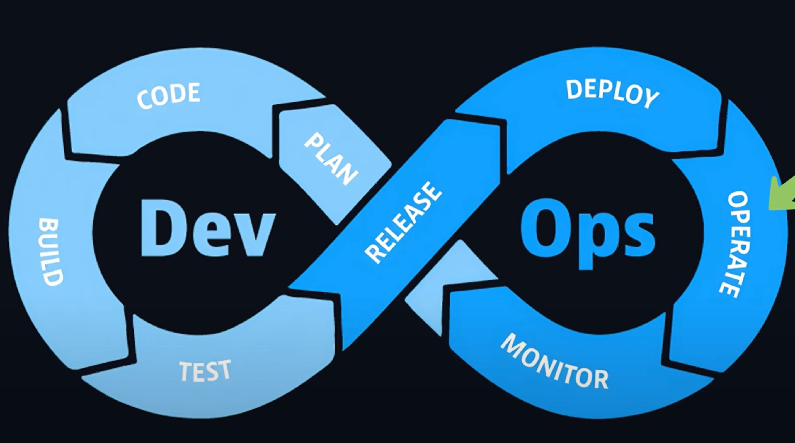

# DevOps Introduction

- This diagram shows that dev and ops are connected and interlinked. Let's look at each step one by one:

## Steps of DevOps

### 1. Plan

- If we are making a multi-million dollar SaaS application, before writing a single line of code, we first plan:
    - what we want to build
    - when to ship
    - who owns what
    - how would we measure success (page speed, user growth, revenue)
- We need to make it tracable (not sticky notes on a white board)
- Use tools which the team would actually make updates:
    - Jira
    - Linear
    - Github Projects
    - Notion
- The tool is less important than the disiplin and tracability

### 2. Code

- Code quality is as important as code output
- Code should be:
    - clean
    - modular
    - Testable
    - that others can extend
- Use
    - Git with reviews
    - Branch rules
    - Automated checks
- Ship readable and structured code which other can make sense of, not just code which you can understand.

### 3. Build

- When we finish writing code, we cannot just put it on prod. Before deploying the code, it often needs to be:
    - Get compiled or transpiled
    - Dependencies installed
    - Bundled or packaged (like in Docker)
    - Check for linting or security mistakes
- Build step is all about making the source code ready for running on deployment. A complied code, an artifact, a package
- This step is often automated through docker - containers (more about this in future)

### 4. Testing

- Ofc testing is for catching bugs and errors early. When they are cheap and easy to fix.
- Testing comes in the CI pipeline, testing eveyrthing like:
    - Unit tests
    - Integration tests
    - End-to-End tests
    - Security scans
- By the time all the tests are passed, team can be confident that app features behave as expected and won't break the system.
- These are also done autmatically and only when the code passes all the tests, is it marked as **ready for release**.
- This doesn't mean it will start running in production now, it's just an approved artifact which is queued for deployment.
- This marks the stage moving from Devs to Ops

### 5. Release

- In practice, the release stage involves:
    - Versioning
    - Tagging artifacts
    - Pushing them into a release repo, like:
        - Docker Hub
        - Sonatype Nexus Repository
        - Internal Store
- This ensures that the same code that was tested is the one deployed. No surprises or mismatches

### 6. Deployment

- Traditional, someone would have had to deploy the code at 2 am manually running some scripts
- But in modern DevOps, the deployment is often automated and repeatable process
- Pipes handle the code and Tools like Kubernettes orchestrate the deployments at scale (more on this in the future)
- Eg:
    - When deploying a new feature, Kubernettes would spin up new pods with the new code and gradually fade out the old code pods, ensuring a smooth trasition.
    - This is called a rolling deployment. Ensures minimal downtime and smooth user exp.
- Some teams also practice Blue-Green deployments or Canary Deployments (testing with a smaller control group before releasing to the entire public)
- Once the code is deployed, the app is live. But the doesn't mean the work is over.

### 7. Operate

- Operate stage is all about ensuring the app runs as expected under real world conditions
- These include:
    - Monitoring server health
    - Scaling resources when traffic spikes
    - Applying security patches
    - Managing infrastructure configs
- Eg:
    - Imagine a E-Commerce store during Diwali-Durresha season, there might be a lot of client traffic at 14:00 hrs when eveyrone is shopping for the holidays. This measn that the servers need to be scalled (horizontally mostly) to accomodate the incoming traffic
    - But the traffic might be very less during the morning 2:00 hrs, so the servers can be scalled back down to save costs.
- DevOps Teams ensure that the app performs:
    - Resilient
    - Stable
    - Performant
- at all times and curcumstances.

### 8. Monitoring

- Monitoring the apps, the teams gather data about the systems performace:
    - uptime
    - error rates
    - business metrics
- Tools including:
    - Prometheus
    - Graphana
    - Data dog
    - New Relic
    - Sentry
- Act as CCTV cameras for our apps. They not only show you technical meters like:
    - CPU usuage
    - Latency or Error logs
- But also business metrics like:
    - orderes processed
    - sign ups completed
    - Revenue Generated
- Eg:
    - If the new checkout flow code increase cart-abandonment rates, monitoring will catch it and feed it back to the planning stage for the next release
    - Hence looking at the metrics, the team can adjust priorities, and impove the product.
- And the cycle starts again
