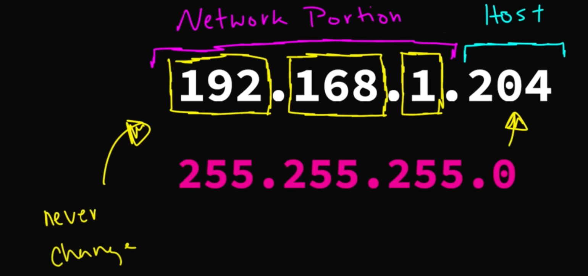

# IP addresses

## Introduction
- IP address are a way to identify devices on a network. If you have a wifi, then it assigns the IP address to all the devices connected to it (through DHCP - Dynamic Host Configuration Protocol).
- Each part (called an octet) is a number between 0 and 255.
- To check your devices IP config:
```bash
ipconfig # for windows: look for a IPv4 address
ifconfig # for macOS, Linux: Look for en0 -> inet
```
- From the above cmd, you will also get the Subnet / Netmask (Mr. Subnet Mask) and the Default Gateway (Default Router / Router for short / Miss Default Gateway)
- Simple hack:
    - If subnet mask octet == 255: then that octet will remain the same
    - If the subnet mask octet == 0: then that octet can be anything (between 0-255)
- NOTE: The unchanging part of the IP address (usually the first three octets) is call teh network portion and the last ctet is called the Host portions.


## Miss Default Gateway
- Whenever a device is trying to connect to a device not on the same network, example: you connecting to youtube or netflix, the device will take help from Miss default gateway.
- Miss default gateway knows everything, and she will be able to send the request to the desired IP address, which is outside of our current network.
- Miss Default Gateway (or default router) has been your Wi-Fi router the entire time. (IKR that was a cool plot twist, scooby-doo level shit)
- Now, not all IP address of a router can be used. There are a few reserved:
```bash
192.168.1.0 # the network address
192.168.1.255 # the broadcast address
192.168.1.1 # the router address (Default Gateway)
```
- Hence right from theh start, we only have 256-3 = 253 usable IP address only.
