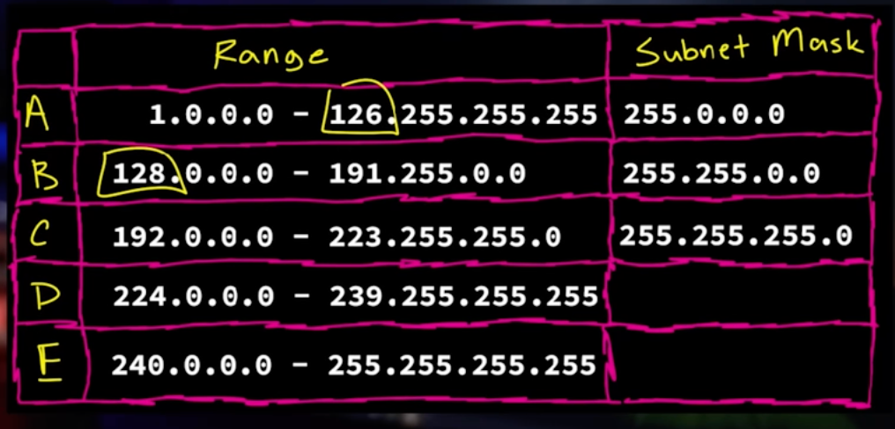

# Submetting

## The Problem
- The inventors of the internet (official board of the Internet is first of January in 1983), thought that we would never run out of the 4.3 billion IP addresses which they had started out with.
- they did not anticipate the amount of devices that we would assign IP addresses to (smart watch, tablets, TVs washing machines, ovens, fridges, smart toilets, etc.)
- 4.3 Billion = 2^32 = 4,294,967,296
- NOT ONLY that, they even sold off large chunks of them cause they thought they had too many and would never run out.

### Simpliest Classification (Literally)

- The IP address (theh majority of which we cannot use) are divided into the following classes:
    - Class  |  Range                       | Default Subnet Mask
    - Class A: 1.0.0.0 - 126.255.255.255    | 255.0.0.0
    - Class B: 128.0.0.0 - 191.255.255.255    | 255.255.0.0
    - Class C: 192.0.0.0 - 223.255.255.255    | 255.255.255.0
    - Class D: 224.0.0.0 - 239.255.255.255
    - Class E: 240.0.0.0 - 255.255.255.255
- Subnet Mask determines how big a network would be, or the range of IP addresses can be assigned to the devices on that network.
- Class A network (or any really large network) is divided into smaller sub-networks. This is done by using a subnet mask (never the default subnet mask as shown above, the IANA (Internet Assigned Numbers Authority) assigns the subnet mask slices to the Class A networks)
- When we take a class network and cut it up using a subnet mask (other than the default subnet mask), we can create more IP addresses, which are called classless networks (cause they are not following the rules of the above class networks).
- So looking at the class table, each class would have gotten the following the networks:
    1. Class A: subnetmask: 255.0.0.0 = 1 x 256 x 256 x 256 = 16,777,216 (Too many hosts per network and Only 126 netwroks)
    2. Class B: subnetmask: 255.255.0.0 = 1 x 1 x 256 x 256 = 65,536
    3. Class C: subnetmask: 255.255.255.0 = 1 x 1 x 1 x 256 = 256 (Ideal: More netwroks and 256 hosts per network)
- We don't talk about D and E cause they are unusable. Class D for multicast and Class E for experimental purposes.
- If we see there is a range of IP addresses that are missing in the Classes: 127.0.0.0 - 127.255.255.255 - 16 million addrs missing. They are in every devices and are called Loopback addresses.
- There are literally 16 million virtual IP addresses in every device to just talk back to itself, AKA your localhost addresses. Can pin then and check:
```bash
ping 127.0.0.1
```
