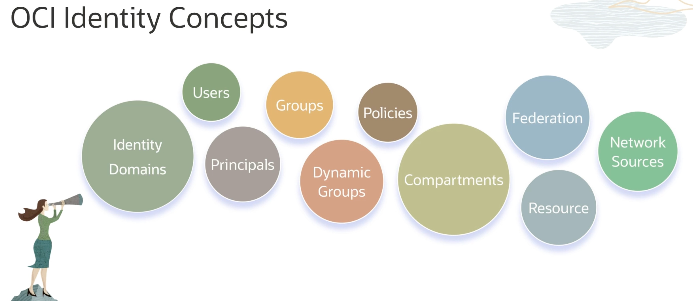
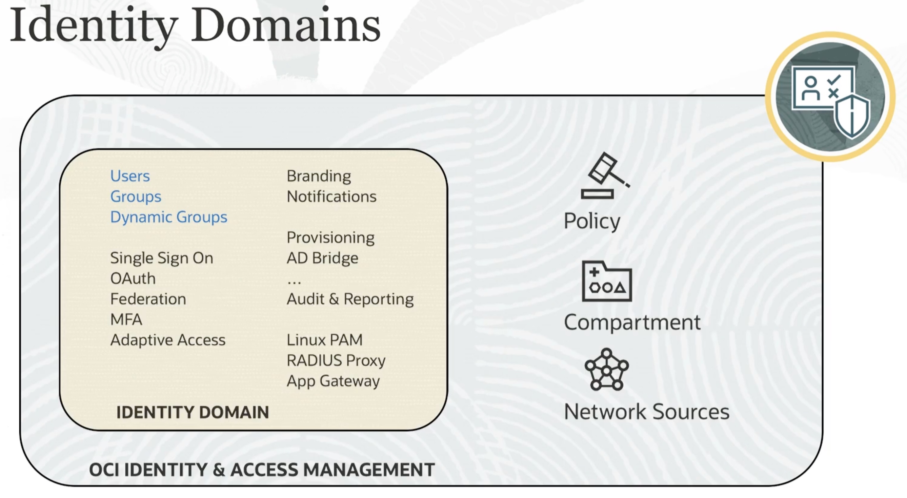
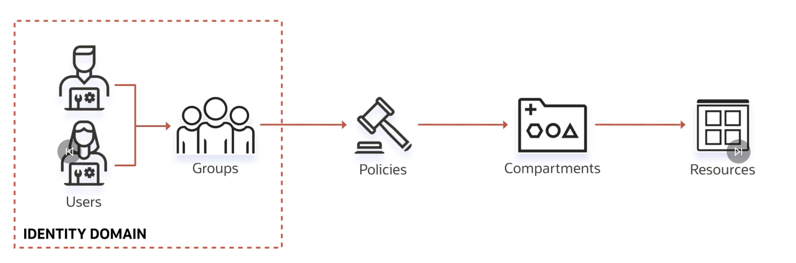
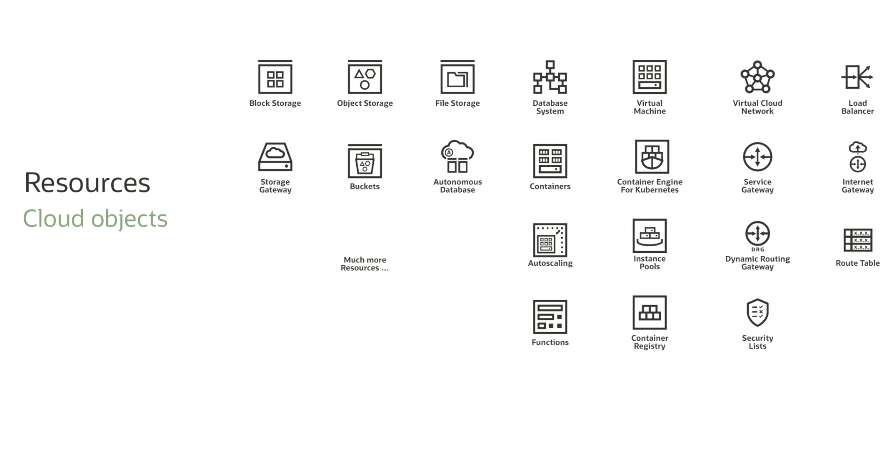
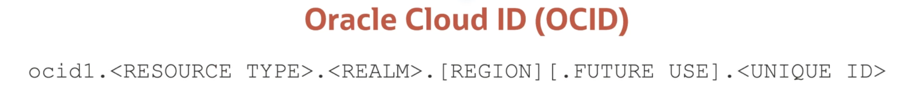
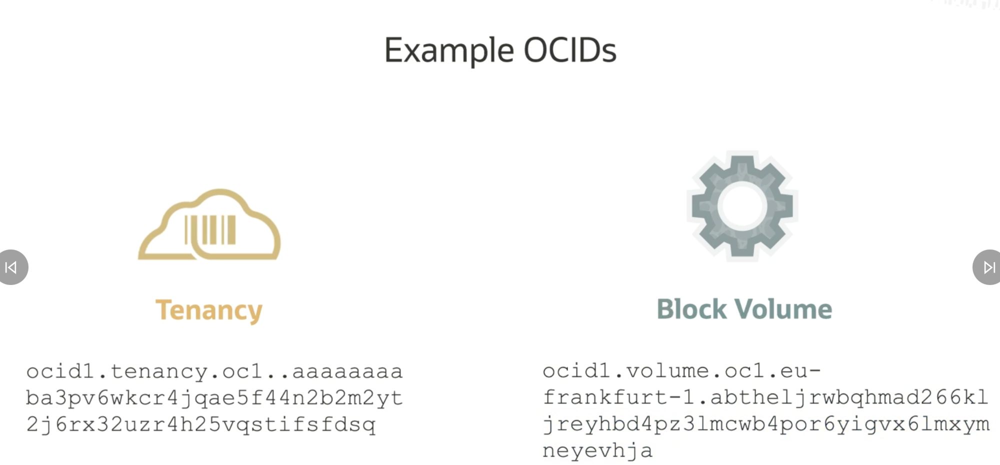

# Identity and Access Management

## IAM Introduction

### OCI IAM
- IAM = Identity and Access Management service a.k.a Fine Grain access control a.k.a Role based access control service.
- There are 2 key ascepts to this:
    1. AuthN (Authentication) - Who are you ?
    2. AuthZ (Autherizations) - What permissions do you have ?
- These allows user to be assigned one or more predetermined roles, and each role comes with a set of permissions.

### OCI Identity Concepts

### Identity Domains

- It is like a container for our users and groups
- An identity domain represents a user population in OCI and associated configurations and security settings

- In pratice:
    - We create OCI Identity Domain
        - Wihtin which there are users which are part of groups
        - We write policies (role-based access) against these groups
        - Policies are scoped to a tenancy (account or compartments)
        - Each compartment has it's own resources
- Resource include:

- To identify each of these OCI recourses they have their own unqiue OCID (Oracle Cloud ID) which are unique Oracle-Assigned Identifiers

- Each section:
    - \<Resource Type\> = type of resource (compute instance, block storage)
    - \<REALM\> = set of regions that share same characteristics (Govt. realm, Commercial Realm)
    - \[REGION\] = The region the resource is in
    - \<UNIQUE ID\> = unique to the created resource

---

## Compartments

- With our Oracle tenancy (account), we also get a Compartment. Think of it as a logical construct which houses alll of our related resources.
- We Create them for Isolate and control access.
- Though the Root compartment can house ALL resources, it is best practice to make dedicated compartments for each isolated resources.

