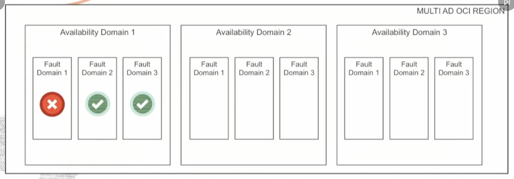

# OCI Foundations
---

## OCI Architecture

1. **Regions**: is a localized Geographic area consisting of one or more availability Domains (AD)

2. **Availability Domains (AD)**: one or more fault tolerant data centers located within a region but connected via a low latency, high brandwidth network

3. **Fault Domains (FD)**: grouping of hardware + infrastructure within a AD that provides anit-afinity - think of them as logical datacenters

### How to Chose a Region?
1. Location: choose a region closest to your users for lowest latency and highest performance
2. Data residency and compliance: many countries have strict data residency requirements, and we must ensure that the region we choose, we need to follow its laws
3. Service availability: new cloud services are made available based on regional demand, regulatory compliance, resource availability, and other factors.

---

## Availability Domains
- isolated from each other, fault-tolerant, unlikely to feel simultaneously
- This is because seperted and do not share Physical resuorces like power, cooling or network, the failure which is affecting one AD will not affect the others

## Fault Domains (FD)
- Ideally each Ad has got 3 FD. Logical data center within an AD
- resources placed in different FDs, will not share single point of hardware failure.
- In any region, recources in at most ONE fault domain are being actively changed at any point in time. This means that availability problems caused by change procedures are isolated to one fault domain level.
- You can control the placement of your compute or database instances to fault domains at instance "launch" time.

---

## Why Ad and FD ?
- The main purpose of multiple ADs and FDs is to **Avoid Single Point of Failure**.
- If we have an app which needs a database instance to run, we can run multiple copies of the app and db instance in different FDs
- If we want to make it even more secure, we can run copies of those FDs in another avaiability zone also, so that even regional dispurtions can be handled.
- But then how woudl the data be synchrozied? OCI has tools like **Data-Gaurd** for that.

---

TLDR; OCI High Availability Design:
1. FDs protect our applications from failures within an AD
2. ADs themselves Help when there is failure in one of the ADs (in multi-Availability regions)
3. Regional Pair - each conuntry there are atleast 2 data centers (ADs / FDs) so that the other can be used for disaster recovery.
4. Always avoid single point of failure arch whenever possible, that's what OCI tries to do
